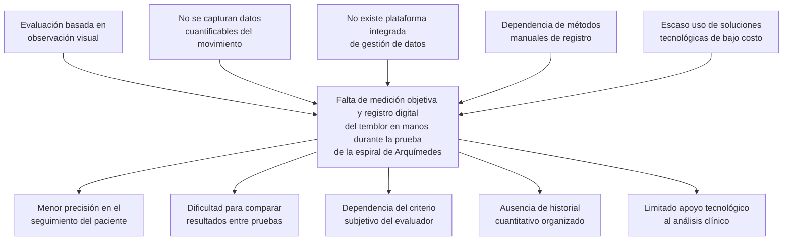
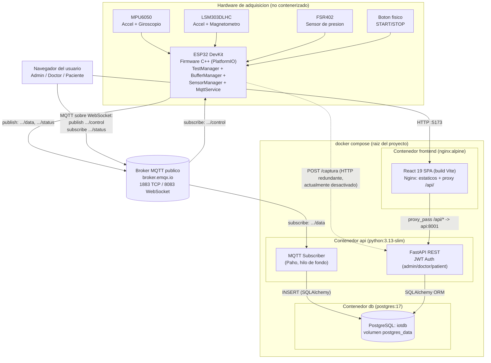
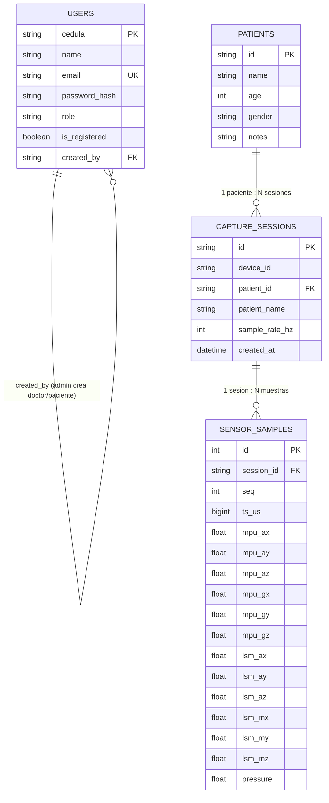
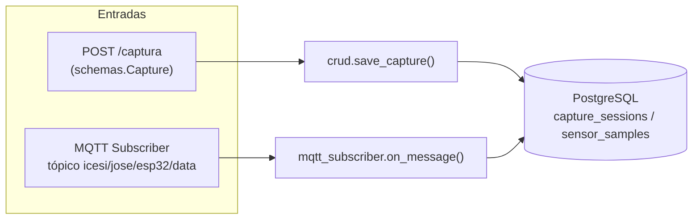
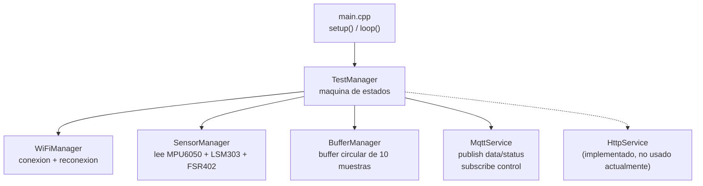
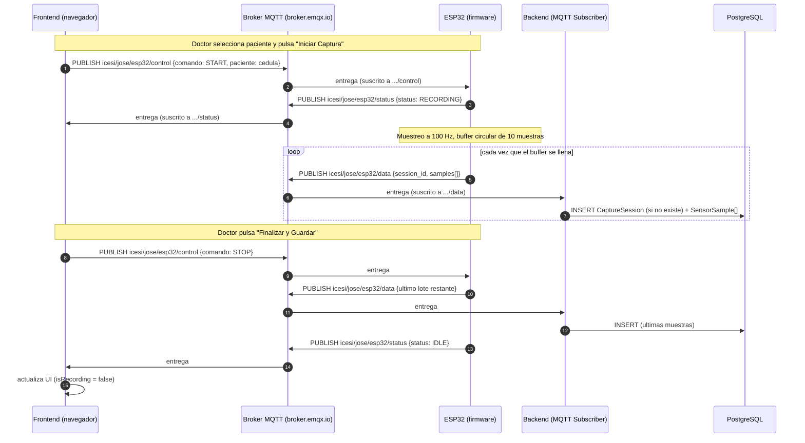

# Documento de Sustentación
## Diseño e Implementación de un Sistema basado en ESP32 para la Medición del Temblor en Manos en la Prueba de la Espiral de Arquímedes

**Autor:** Jose David Rodríguez Pinilla — Ingeniería Telemática, Universidad Icesi
**Proyecto:** ProyectoIntegrador1-Tel

> Este documento resume el estado **completo y actual** del proyecto y está organizado para servir de guion directo para la presentación final. Cada sección corresponde a uno de los criterios de evaluación solicitados.

---

## 0. Resumen ejecutivo — checklist de criterios

| # | Criterio solicitado | Estado | Sección |
|---|----------------------|:------:|---------|
| 1 | Resumen de la fase de análisis (contexto, problema de ingeniería, justificación) | ✅ | [1](#1-fase-de-análisis) |
| 2 | Decisiones de diseño + diagramas finales (BD y bloques), actualizados respecto a la fase de diseño | ✅ | [2](#2-decisiones-de-diseño-y-arquitectura-final) |
| 3 | App web que permite **accionar, visualizar y gestionar** el ecosistema | ✅ | [3](#3-aplicación-web-de-usuario-accionar-visualizar-y-gestionar) |
| 4 | Nodo lógico con persistencia en BD según esquema de datos | ✅ | [4](#4-nodo-lógico-de-persistencia-backend--base-de-datos) |
| 5 | Implementación física completa y funcionando | ✅ | [5](#5-implementación-física-hardware) |
| 6 | Mensajería asíncrona entre cualquier par de nodos del ecosistema | ✅ | [6](#6-mensajería-asíncrona-entre-nodos) |
| 7 | Aplicación contenerizada | ✅ | [7](#7-contenerización) |

---

## 1. Fase de Análisis

### 1.1 Contexto inicial

El temblor en las manos es uno de los signos clínicos más comunes en trastornos del movimiento (Parkinson, temblor esencial, temblores inducidos por medicamentos, entre otros). Una de las pruebas clásicas para evaluarlo es la **espiral de Arquímedes**: el paciente dibuja una espiral sobre una hoja mientras el especialista observa irregularidades, oscilaciones y presión del trazo.

Tradicionalmente esta evaluación es **visual y subjetiva**: el médico compara el dibujo resultante con escalas de referencia (p. ej. escalas de severidad de Parkinson), sin ningún tipo de medición cuantitativa del movimiento real de la mano durante la prueba.

### 1.2 Problema de ingeniería

**Problema central identificado:**

> *"Falta de medición objetiva y registro digital del temblor en manos durante la prueba de la espiral de Arquímedes."*

**Causas raíz:**

1. La evaluación se basa en observación visual del especialista.
2. No se capturan datos cuantificables del movimiento de la mano.
3. No existe una plataforma integrada de gestión de datos clínicos para esta prueba.
4. Persiste la dependencia de métodos manuales de registro (papel, observación).
5. Escaso uso de soluciones tecnológicas de bajo costo en consultorios para este tipo de evaluación.

**Efectos:**

1. Menor precisión en el seguimiento del paciente a lo largo del tiempo.
2. Dificultad para comparar resultados entre pruebas (no hay línea base cuantitativa).
3. Dependencia del criterio subjetivo del evaluador (variabilidad inter-observador).
4. Ausencia de un historial cuantitativo organizado por paciente.
5. Limitado apoyo tecnológico al análisis clínico del temblor.



### 1.3 Justificación del proyecto

- **Objetivar la medición:** sensores inerciales (acelerómetro, giroscopio, magnetómetro) y un sensor de presión permiten cuantificar amplitud, frecuencia y fuerza del temblor durante la prueba, en lugar de depender solo de la inspección visual del trazo.
- **Trazabilidad clínica:** cada prueba queda asociada a un paciente y queda almacenada con fecha/hora, permitiendo construir un historial comparable en el tiempo.
- **Accesibilidad remota:** una aplicación web permite que el personal médico consulte resultados desde cualquier lugar, sin depender de que el dispositivo y el computador estén en la misma red.
- **Costo accesible:** se utiliza hardware de bajo costo (ESP32 + sensores comerciales MPU6050, LSM303DLHC, FSR402), apto para consultorios con recursos limitados.
- **Control de acceso:** al tratarse de información clínica, el sistema incorpora autenticación y roles (administrador, doctor, paciente), algo que no estaba contemplado en el alcance original y que responde a un requisito real de cualquier sistema médico.

### 1.4 Objetivos

**Objetivo general**

Diseñar e implementar un sistema basado en ESP32 que permita capturar, transmitir, almacenar y visualizar de forma digital las señales de movimiento y presión de la mano de un paciente durante la prueba de la espiral de Arquímedes, integrado con una plataforma web de gestión clínica.

**Objetivos específicos**

1. Capturar señales de aceleración, velocidad angular, campo magnético y presión a una frecuencia de muestreo constante (100 Hz) usando un ESP32 y tres sensores (MPU6050, LSM303DLHC, FSR402).
2. Transmitir los lotes de muestras en tiempo real desde el ESP32 hacia un backend central mediante un protocolo de mensajería asíncrona (MQTT).
3. Persistir los datos en una base de datos relacional, estructurados por paciente, sesión de captura y muestra individual.
4. Proveer una interfaz web que permita **gestionar** pacientes y doctores, **accionar** remotamente el inicio/fin de una prueba, y **visualizar** el historial y el detalle gráfico de cada sesión.
5. Implementar control de acceso basado en roles (admin / doctor / paciente) mediante autenticación JWT.
6. Contenerizar toda la solución (excepto el hardware embebido) para permitir un despliegue reproducible con un único comando.

---

## 2. Decisiones de Diseño y Arquitectura Final

### 2.1 Arquitectura general (resumen)

El sistema final está compuesto por **4 nodos lógicos**, todos conectados a través de un **broker MQTT público** (`broker.emqx.io`), que actúa como bus de mensajería asíncrona del ecosistema:

1. **Hardware (ESP32 + sensores):** captura las señales y las publica por MQTT.
2. **Backend (FastAPI + suscriptor MQTT):** recibe los datos, valida, persiste en PostgreSQL y expone una API REST con autenticación JWT.
3. **Frontend (React 19 + Nginx):** SPA clínica con login, gestión de pacientes/doctores, control remoto de la captura (vía MQTT) y visualización de resultados.
4. **Base de datos (PostgreSQL 17):** persistencia de usuarios, pacientes, sesiones y muestras.

Toda la solución (excepto el ESP32, que es hardware físico) corre como **contenedores Docker** orquestados por un único `docker-compose.yml` en la raíz del proyecto.

### 2.2 Diagrama de bloques / despliegue (actualizado)

> Este diagrama **reemplaza** los diagramas `Diagrama-Contenerizado.png` y `Diagrama_despliegue2.png` de la fase de diseño, que aún mostraban un broker Mosquitto local y una base de datos "Neon PostgreSQL" en la nube — arquitectura que cambió durante la implementación (ver tabla comparativa en la sección [2.4](#24-cambios-respecto-a-la-fase-de-diseño)).



**Puertos expuestos:**

| Servicio | Build/Imagen | Puerto host | Rol |
|----------|-------------|-------------|-----|
| `frontend` | `./frontend` (Nginx) | `5173:80` | SPA + proxy `/api/` |
| `api` | `./backend` (FastAPI) | `8001:8001` | API REST + suscriptor MQTT |
| `db` | `postgres:17` | `127.0.0.1:5432:5432` | PostgreSQL (solo localhost) |

### 2.3 Diagrama Entidad-Relación (actualizado)

> Este diagrama **reemplaza** `Diagrama-EntidadRelacion.png` de la fase de diseño. El modelo original contemplaba entidades genéricas de telemetría IoT (`Device`, `Batch`, `Metrics`, `TransmissionLog`). Durante la implementación el modelo se reorientó hacia un **dominio clínico** con autenticación y gestión de pacientes (ver sección [2.4](#24-cambios-respecto-a-la-fase-de-diseño)).



**Notas del modelo:**

- `PATIENTS.id` y `USERS.cedula` comparten el mismo valor (la cédula de la persona) por convención de la aplicación, pero **no existe una FK declarada entre ambas tablas** — la resolución se hace por lógica de negocio (`crud.py` / `mqtt_subscriber.py` buscan el paciente por cédula al crear una `CaptureSession`).
- `CAPTURE_SESSIONS.patient_id` es `nullable` porque el ESP32 puede enviar un nombre de paciente que aún no exista como registro (`patient_name = "Anónimo"` por defecto).
- `SENSOR_SAMPLES` agrupa en una sola tabla las 3 fuentes de datos (MPU6050, LSM303DLHC, FSR402) para simplificar las consultas de series de tiempo por sesión.

### 2.4 Cambios respecto a la fase de diseño

| Aspecto | Diseño inicial (fase de diseño) | Implementación final | Justificación del cambio |
|---|---|---|---|
| **Modelo de datos** | Entidades genéricas de telemetría: `Device`, `CaptureSession`, `Batch`, `SensorSample`, `TransmissionLog`, `Metrics` | `User` (auth + roles), `Patient`, `CaptureSession`, `SensorSample` | El proyecto evolucionó de un sistema genérico de telemetría a un **sistema clínico con control de acceso**. Se simplificó eliminando entidades de bajo valor para el caso de uso (`Batch`, `TransmissionLog`, `Metrics` calculadas en el backend) y se priorizó la trazabilidad paciente → sesión → muestra. |
| **Broker MQTT** | Contenedor Mosquitto local, tópicos `sensor/data` y `session/control` | Broker público `broker.emqx.io`, tópicos `icesi/jose/esp32/data\|status\|control` | El backend escuchaba un broker/tópico distinto al que usaba el firmware del ESP32, por lo que **nunca llegaban datos por MQTT**. Usar un broker público al que ambos extremos llegan por internet resuelve el problema de NAT/firewall sin exponer puertos MQTT propios. |
| **Base de datos** | "Neon PostgreSQL" (servicio cloud externo) | PostgreSQL 17 en contenedor propio (`db`), con volumen `postgres_data` y healthcheck `pg_isready` | Control total del entorno de despliegue, sin depender de credenciales/cuentas externas; arranque coordinado vía `depends_on: condition: service_healthy`. |
| **Autenticación** | No contemplada en el diseño inicial | JWT (HS256) + bcrypt + roles `admin` / `doctor` / `patient` | Requisito real de un sistema médico: solo personal autorizado gestiona pacientes y ejecuta capturas; cada paciente solo ve su propio historial. |
| **Transmisión ESP32 → Backend** | Flujo único vía HTTP POST `/captura` | MQTT como **vía primaria** (`icesi/jose/esp32/data`); el endpoint HTTP `/captura` y el `HttpService` del firmware se mantienen implementados como **vía redundante**, actualmente desactivada en el firmware activo | El ESP32 no siempre puede alcanzar la IP/puerto del backend por HTTP (NAT, redes distintas). MQTT contra un broker público funciona desde cualquier red porque ambos extremos salen a internet. |
| **Frontend** | Cliente web simple, sin contenedor propio explícito | Contenedor `frontend` (Nginx) que sirve el build de Vite y hace de **proxy inverso** `/api/` hacia `api:8001` | Permite levantar todo el ecosistema con `docker compose up --build`, sin hardcodear IPs/puertos del backend en el JavaScript que corre en el navegador del usuario. |
| **Migraciones de BD** | No especificado | `run_migrations()` con `ALTER TABLE` autoreparable en `database.py` | `Base.metadata.create_all()` no agrega columnas a tablas ya existentes; se evita Alembic por la escala del proyecto académico, agregando manualmente cada `ALTER TABLE` cuando cambia el modelo. |
| **Control remoto del hardware** | No contemplado explícitamente | Tópico `icesi/jose/esp32/control` (START/STOP) publicado desde el frontend y consumido por el firmware | Habilita el criterio de "**accionar** el ecosistema desde la app web" sin necesidad de presionar el botón físico del ESP32. |

---

## 3. Aplicación Web de Usuario (Accionar, Visualizar y Gestionar)

La SPA en React 19 (`frontend/src`) es el **panel de control central** del ecosistema. Implementa autenticación JWT, navegación basada en estados (`App.jsx`, sin React Router) y guards de rol antes de cada pantalla.

### 3.1 Autenticación y roles

| `currentScreen` | Componente | Roles permitidos | Función |
|-----------------|-----------|-------------------|---------|
| `hub` | `MainHub` | Todos | Panel principal, accesos según rol, info de los sensores |
| `history` | `DashboardModern` | Todos (paciente ve solo sus sesiones) | **Visualizar** historial de pruebas |
| `patients` | `PatientManagement` | Doctor, Admin | **Gestionar** pacientes |
| `patient-detail` | `PatientDetail` | Doctor, Admin | Detalle de paciente + sus sesiones |
| `doctors` | `DoctorManagement` | Admin | **Gestionar** doctores |
| `capture` | `CaptureModern` | Solo Doctor | **Accionar** inicio/fin de captura |
| `analysis` | `AnalysisModern` | Todos | **Visualizar** detalle gráfico de una sesión |

Flujo de roles:

```
Admin → crea doctor (cédula + nombre)
  Doctor activa su cuenta (cédula → email + password)
    Doctor crea paciente (cédula + nombre + edad + género + notas)
      Paciente activa su cuenta (cédula → email + password)
        Paciente ve únicamente su propio historial
```

### 3.2 Accionar el ecosistema (control remoto vía MQTT)

El componente `CaptureModern.jsx` permite a un **doctor** controlar la captura de datos del ESP32 **sin tocar el dispositivo físicamente**:

- Se conecta al broker público vía **WebSocket** (`ws://broker.emqx.io:8083/mqtt`) usando `mqttService.js`.
- Botón **"INICIAR CAPTURA"** → publica en `icesi/jose/esp32/control`:
  ```json
  { "comando": "START", "paciente": "<cedula_paciente>", "ts": 1234567890 }
  ```
- Botón **"FINALIZAR Y GUARDAR"** → publica:
  ```json
  { "comando": "STOP", "ts": 1234567890 }
  ```
- El estado del dispositivo (`Conectado` / `Desconectado` / `Error`) se deriva del estado de la conexión MQTT (`mqttStatus` en `App.jsx`).
- El botón de inicio queda **bloqueado con mensajes explicativos** si: el ESP32 no está conectado al broker, o no se ha seleccionado un paciente.
- El estado real "GRABANDO / IDLE" se sincroniza en tiempo real escuchando el tópico `icesi/jose/esp32/status`, que publica el propio firmware — esto evita que la UI quede "atascada" si el ESP32 se desconecta a mitad de una prueba.

### 3.3 Visualizar (Dashboard + Análisis)

- **`DashboardModern.jsx`** ("Historial Clínico" / "Mis Resultados" según el rol): lista todas las sesiones (`GET /sesiones`), con buscador por ID de sesión, paciente o dispositivo. Si el usuario es `patient`, se filtra automáticamente por `session.patientId === user.cedula`.
- **`AnalysisModern.jsx`**: al seleccionar una sesión (`GET /captura/{session_id}`), grafica con **Recharts**:
  - Aceleración y giro del MPU6050 (3 ejes).
  - Aceleración y campo magnético del LSM303DLHC (3 ejes).
  - Presión del FSR402.
  - KPIs calculados en el cliente: presión promedio/máxima, aceleración resultante máxima, número de muestras.
  - Si la sesión existe pero no tiene muestras (`count === 0`), se muestra una pantalla de "Sesión sin datos" con explicación.

### 3.4 Gestionar (pacientes y doctores)

- **`PatientManagement.jsx`** (Doctor/Admin): crea pacientes (cédula validada `^\d{6,12}$`, nombre, edad 1–120, género, notas). Al crear un paciente se crea también automáticamente un `User` con rol `patient` y `is_registered = false`, listo para que el paciente complete su registro.
- **`PatientDetail.jsx`**: muestra los datos del paciente y su lista de sesiones (con fecha real `created_at`); botón "Nueva Medición" solo visible para doctores (`onNewCapture !== null`).
- **`DoctorManagement.jsx`** (solo Admin): crea pre-registros de doctores (cédula + nombre); el doctor luego activa su cuenta vía `RegisterFlow`.
- Todos los formularios usan `getErrorMessage()` para normalizar errores 4xx/422 de FastAPI y resetean su estado completo al cerrarse (`onOpenChange` + botón Cancelar).

---

## 4. Nodo Lógico de Persistencia (Backend + Base de Datos)

El contenedor `api` (FastAPI + SQLAlchemy + PostgreSQL) es el **nodo lógico central de persistencia** del ecosistema: toda la información de usuarios, pacientes, sesiones y muestras converge aquí, sin importar si llegó por HTTP o por MQTT.

### 4.1 Doble vía de ingestión hacia el mismo esquema



Ambas rutas:
1. Verifican si ya existe una `CaptureSession` con ese `session_id`.
2. Si no existe, resuelven el `patient_id` a partir de `patient_name` (la cédula que el frontend envía como "paciente" al accionar el START) buscando en la tabla `patients`.
3. Crean la sesión y guardan cada muestra (`SensorSample`) del lote recibido.

> En la práctica, **MQTT es la vía primaria de persistencia** porque no depende de que el ESP32 alcance la IP del backend por HTTP — solo depende de que ambos lleguen a `broker.emqx.io`.

### 4.2 Endpoints de la API REST

| Método | Ruta | Auth | Descripción |
|--------|------|------|-------------|
| GET | `/` | Libre | Health check (usado por el frontend cada 30s) |
| POST | `/auth/check-cedula` | Libre | Verifica cédula en sistema (pre-registro) |
| POST | `/auth/complete-registration` | Libre | Completa registro (email + password) |
| POST | `/auth/login` | Libre | Login por correo o cédula |
| GET | `/auth/me` | JWT | Usuario autenticado |
| POST | `/users/doctors` | Admin | Crea pre-registro de doctor |
| GET | `/users/doctors` | Admin | Lista doctores |
| GET | `/patients` | Doctor/Admin | Lista pacientes |
| POST | `/patients` | Doctor/Admin | Crea paciente + usuario `patient` |
| GET | `/patients/{id}` | JWT | Detalle de paciente + sus sesiones |
| POST | `/captura` | Libre (ESP32) | Recibe lote de muestras (vía HTTP) |
| GET | `/sesiones` | JWT | Lista todas las sesiones |
| GET | `/captura/{session_id}` | JWT | Datos crudos de una sesión |

### 4.3 Seguridad y migraciones

- **Autenticación:** JWT HS256 (`auth.py`), payload `{sub: cedula, name, role, exp}`, expiración 24h. Hash de contraseñas con **bcrypt directo**.
- **Roles:** `get_current_user`, `require_admin`, `require_doctor` (acepta admin y doctor) como dependencias de FastAPI.
- **Seed admin:** al arrancar, `crud.seed_admin()` crea (o repara) un usuario administrador por defecto.
- **Migraciones autoreparables:** `database.run_migrations()` agrega por `ALTER TABLE` las columnas `patient_id`, `patient_name` y `created_at` a `capture_sessions` si no existen — necesario porque `create_all()` no modifica tablas ya creadas en despliegues previos.

---

## 5. Implementación Física (Hardware)

### 5.1 Componentes físicos

| Componente | Función | Interfaz |
|---|---|---|
| **ESP32 DevKit** | Microcontrolador principal (doble núcleo, WiFi) | — |
| **MPU6050** | Acelerómetro + giroscopio (IMU 6 ejes) | I2C |
| **LSM303DLHC** | Acelerómetro + magnetómetro (orientación) | I2C |
| **FSR402** | Sensor resistivo de presión/fuerza | Entrada analógica (pin 34, ADC 12 bits) |
| **Botón físico** | Inicio/fin de prueba (debounce 300 ms) | Pin 0 (`INPUT_PULLUP`) |

### 5.2 Arquitectura del firmware (PlatformIO / Arduino C++)



- **`TestManager`** es el núcleo: en `update()` revisa el botón físico, atiende el loop MQTT, muestrea sensores cada `SAMPLE_PERIOD_US` (100 Hz) y, cuando el buffer de 10 muestras se llena, lo publica vía MQTT y limpia el buffer.
- **`startTest()` / `stopTest()`** se invocan tanto desde el botón físico como desde el callback MQTT del tópico `icesi/jose/esp32/control` — es decir, **el mismo firmware atiende control local y remoto**.
- **`SensorManager.fillSample()`** llena una muestra (`Sample`) leyendo los 3 sensores y calculando el timestamp relativo (`ts_us`).
- **`MqttService`**: cliente `PubSubClient` con buffer ampliado a 8000 bytes (`MQTT_MAX_PACKET_SIZE=8192`) para soportar lotes JSON grandes; se conecta a `broker.emqx.io:1883`, se suscribe a `icesi/jose/esp32/control` y publica en `.../data` y `.../status`.
- **`WiFiManager`**: desactiva el *brownout detector* (picos de corriente del radio WiFi causaban reinicios) y reintenta la conexión hasta 20 veces.
- **`HttpService`**: implementado (sanitiza `NaN`/`Inf`, arma el mismo payload JSON y hace `POST` a `SERVER_URL`), pero las llamadas están **comentadas en `TestManager`** ("Eliminamos HTTP para evitar bloqueos") — queda como vía redundante lista para reactivarse.

### 5.3 Estado de funcionamiento

✅ **La implementación física está completa y operativa**: el ESP32 inicializa los 3 sensores, mide a 100 Hz, responde al botón físico y a comandos remotos MQTT, y transmite los lotes en tiempo real al broker — de donde el backend los persiste automáticamente.

**Mejoras identificadas para trabajo futuro** (no bloquean la entrega actual):
- Reactivar la vía HTTP como redundancia real (actualmente desactivada, y `SERVER_URL` apunta a una IP de LAN específica, lo que la limita a la misma red).
- Persistir el buffer en memoria flash si se pierde la conexión WiFi/MQTT, para no perder muestras durante cortes.

---

## 6. Mensajería Asíncrona entre Nodos

Todo el ecosistema (hardware, backend y frontend) se conecta como **cliente MQTT** al mismo broker público `broker.emqx.io`, formando un **bus de mensajería publish/subscribe** desacoplado: ningún nodo conoce la dirección IP de los demás, todos publican y se suscriben a tópicos conocidos.

### 6.1 Tópicos y pares de nodos

| Tópico | Publica | Se suscribe | Payload | Propósito |
|---|---|---|---|---|
| `icesi/jose/esp32/data` | **ESP32** (firmware) | **Backend** (`mqtt_subscriber.py`) | `{session_id, device_id, patient_name, sample_rate_hz, samples[]}` | Telemetría en lotes → persistencia primaria |
| `icesi/jose/esp32/status` | **ESP32** (firmware) | **Frontend** (`mqttService.js`, todos los clientes) | `{status: "RECORDING"\|"IDLE", session_id?, patient_name?, ts}` | Sincroniza el estado de grabación en la UI en tiempo real |
| `icesi/jose/esp32/control` | **Frontend** (`CaptureModern.jsx`) | **ESP32** (firmware) | `{comando: "START"\|"STOP", paciente?, ts}` | Acciona remotamente el inicio/fin de la prueba |

Esto cubre los **3 pares de nodos** del ecosistema de aplicaciones:
- **ESP32 → Backend** (datos de telemetría)
- **ESP32 → Frontend** (estado del dispositivo)
- **Frontend → ESP32** (comandos de control)

### 6.2 Diagrama de secuencia (flujo completo de una prueba)



---

## 7. Contenerización

Todo el ecosistema (excepto el ESP32) se despliega con **Docker Compose** desde el archivo canónico `/docker-compose.yml` en la raíz del proyecto.

### 7.1 Servicios

```yaml
services:
  api:
    build: ./backend
    ports: ["8001:8001"]
    depends_on:
      db:
        condition: service_healthy
    environment:
      - DATABASE_URL=postgresql://postgres:postgres@db:5432/iotdb
      - MQTT_BROKER=broker.emqx.io
      - MQTT_PORT=1883
      - MQTT_TOPIC=icesi/jose/esp32/data

  frontend:
    build: ./frontend
    ports: ["5173:80"]
    depends_on: [api]

  db:
    image: postgres:17
    ports: ["127.0.0.1:5432:5432"]
    volumes: ["postgres_data:/var/lib/postgresql/data"]
    healthcheck:
      test: ["CMD-SHELL", "pg_isready -U postgres -d iotdb"]
```

| Servicio | Imagen/Build | Puerto host | Descripción |
|----------|-------------|-------------|-------------|
| `api` | `./backend` (Dockerfile: `python:3.13-slim`) | `8001:8001` | FastAPI + suscriptor MQTT. Espera a `db` saludable. |
| `frontend` | `./frontend` (Dockerfile multi-stage: `node:22-alpine` build → `nginx:alpine`) | `5173:80` | React 19 compilado + Nginx (proxy `/api/`). |
| `db` | `postgres:17` | `127.0.0.1:5432:5432` | PostgreSQL con volumen persistente `postgres_data`, solo accesible desde localhost. |

### 7.2 Build multi-stage del frontend

```dockerfile
# Etapa 1: build de la SPA con Vite
FROM node:22-alpine AS build
WORKDIR /app
COPY package.json package-lock.json ./
RUN npm ci
COPY . .
RUN npm run build

# Etapa 2: servir los estáticos con nginx
FROM nginx:alpine
COPY --from=build /app/dist /usr/share/nginx/html
COPY nginx.conf /etc/nginx/conf.d/default.conf
EXPOSE 80
CMD ["nginx", "-g", "daemon off;"]
```

### 7.3 Levantar el sistema

```bash
# Desde la raíz del proyecto (donde está docker-compose.yml)
docker compose up --build

# Frontend → http://localhost:5173
# API       → http://localhost:8001
# DB        → 127.0.0.1:5432 (solo localhost)
```

Todos los servicios tienen `restart: unless-stopped` (excepto `db`, con `restart: always`), y `api` espera explícitamente a que `db` pase su healthcheck `pg_isready` antes de arrancar.

---

## 8. Conclusiones

El sistema cumple de forma integral con los 7 criterios evaluados:

1. **Análisis:** se identificó y justificó un problema de ingeniería real (falta de medición objetiva del temblor en la prueba de la espiral de Arquímedes).
2. **Diseño:** la arquitectura evolucionó respecto a la fase de diseño (broker público en vez de Mosquitto local, modelo de datos clínico con auth en vez de entidades genéricas de telemetría, BD local en vez de cloud) — cambios justificados y documentados en la sección 2.4.
3. **App web:** un único panel React permite **accionar** (control remoto MQTT START/STOP), **visualizar** (dashboard + gráficas detalladas) y **gestionar** (pacientes, doctores, roles) todo el ecosistema.
4. **Nodo lógico de persistencia:** FastAPI + PostgreSQL, con doble vía de ingestión (HTTP/MQTT) hacia el mismo esquema relacional, y migraciones autoreparables.
5. **Implementación física:** ESP32 + 3 sensores funcionando a 100 Hz, con control local (botón) y remoto (MQTT).
6. **Mensajería asíncrona:** los 3 nodos del ecosistema (hardware, backend, frontend) se comunican de forma desacoplada vía pub/sub MQTT sobre `broker.emqx.io`.
7. **Contenerización:** 3 servicios (`frontend`, `api`, `db`) desplegables con `docker compose up --build` desde un único archivo canónico.

**Líneas de trabajo futuro:** reactivar la vía HTTP como redundancia real, persistencia local (flash) ante cortes de conectividad, y cifrado TLS para las conexiones MQTT.
